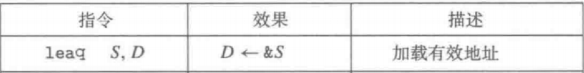
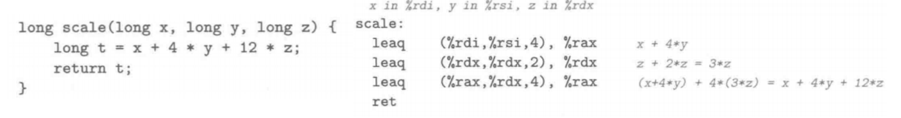
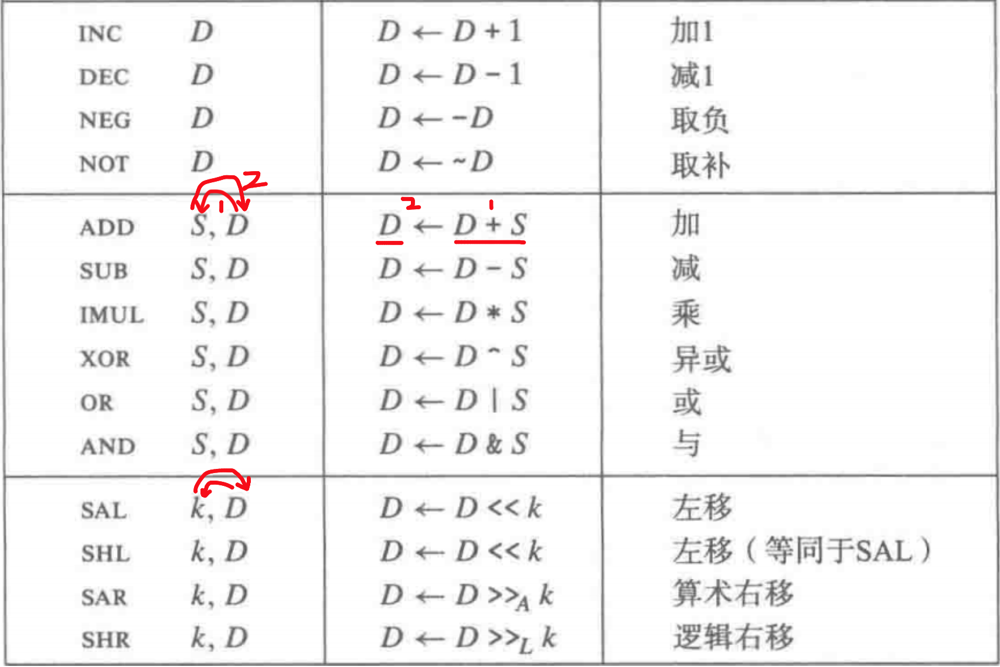

# ICS Part1

>This list only contains "in-scope" knowledges

## Representing and Manipulating Information

- 2.1 Information Storage
    - **Convertion between decimal, binary and hex values**
    - **Byte ordering (Big endian and little endian)**
    - **Bit-level operations (&, |, ~, ^)**
    - Logical operations (||, &&, !)
    - **Shift operations** (logical shift, arithmetic shift), arithmetic right shifts for signed data
- 2.2 Integer Representations
    - Unsigned encoding and signed encoding (two’s complement)
        - **Maximum value, minimum value**
    - Conversion between signed and unsigned
        - Explict convertion, **implict convertion**
    - **Expanding and Truncating numbers**
        - From long to int
        - From int to long
- 2.3 Integer Arithmetic
    - Unsigned/Signed addition (**Overflow, underflow**)
    - **Two’s complement negation**
    - Unsigned/Signed multiplication (Overflow)
    - Dividing: out of scope
- 2.4: Out of Scope
		

### 2.1 Information Storage

- [X]  **Convertion between decimal(10), binary(2) and hex(16) values**

| Hex | Dec | Bin  |
| --- | --- | ---- |
| 0   | 0   | 0000 |
| 1   | 1   | 0001 |
| 2   | 2   | 0010 |
| 3   | 3   | 0011 |
| 4   | 4   | 0100 |
| 5   | 5   | 0101 |
| 6   | 6   | 0110 |
| 7   | 7   | 0111 |
| 8   | 8   | 1000 |
| 9   | 9   | 1001 |
| A   | 10  | 1010 |
| B   | 11  | 1011 |
| C   | 12  | 1100 |
| D   | 13  | 1101 |
| E   | 14  | 1110 |
| F   | 15  | 1111 |

B->D: $D = \Sigma_{i=-m}^{n-1}B_i*2^i$
H->D: $D = \Sigma_{i=-m}^{n-1}H_i*16^i$
D->B: 模2取余法（整数部分） / 乘2法（小数部分）
B->H / H->B: 数位扩展法

```bash
# D -> B（整数）
117D = ?B
obviously：1110101B
```

```bash
# D -> B（小数）
0.8125D = ?B

0.8125 x 2 = 1.625 --- b0 = 1
0.625 x 2 = 1.25 --- b1 = 1
0.25 x 2 = 0.5 --- b2 = 0
0.5 x 2 = 1 --- b3 = 1
由于小数部分已经为0，所以终止运行

原式 = 0.1101B
```

>- **取小数部分**：只取十进制数的小数部分进行转换
>- **乘以2**：将小数部分乘以2
>- **记录整数部分**：记录乘以2后的结果的整数部分（0或1），作为二进制小数的一个位
>- **更新小数部分**：将结果的小数部分作为新的小数部分
>- **重复步骤2-4**：重复上述过程， _直到小数部分为0_ 或达到所需的精度

```bash
# B -> H
1110101.11B = ?H
LHS => 0111 0101
		7   5
RHS => 1100
		C
		
1110101 . 11B = 75 . CH
```

```bash
# H -> B
EA.11H = ?B
E: 1110
A: 1010
1: 0001
1: 0001

EA.11H = 1110 1010 . 0001 0001B
```

- [X] **Byte ordering (Big endian and little endian)**

|                | "ILP32"             | "LP64"              |
| -------------- | ------------------- | ------------------- |
| C Data Type    | Typical 32-bit      | Typical 64-bit      |
| char short int | 1<br><br>2<br><br>4 | 1<br><br>2<br><br>4 |
| long           | 4                   | 8                   |
| float double   | 4<br><br>8          | 4<br><br>8          |
| pointer        | 4                   | 8                   |


- [X] **Bit-level operations (&, |, ~, ^)**

- A&B = 1 when both A=1 and B=1
- A|B = 1 when either A=1 or B=1 or both
- ~A = 1 when A=0
- A^B = 1 when A=1 or B=1, but not both (__Xor__)

>1. View arguments as bit vectors 
>2. Arguments applied bit-wise|

- [X] Logical operations (||, &&, !)

- View 0 as “False” 
- __Anything nonzero as “True” __
- Always return 0 or 1 
- __Early termination__

> Watch out for && vs. & (and || vs. |)… Super common C programming pitfall

```bash
!0x41 → 0x00
!0x00→ 0x01
!!0x41 → 0x01

0x69 && 0x55 → 0x01 
0x69 || 0x55 → 0x01
p && *p (avoids null pointer access)
```

We usually use `if (p && *p)` to avoid null pointer access:

>BGD: dereference operation `*p` on a null pointer is illegal

- **Step 1**: Evaluate `p`.
    - If `p` is null (i.e., `p == NULL`), the expression `p` evaluates to false (0).
    - If `p` is non-null, the expression `p` evaluates to true (non-zero).
- **Step 2**: Short-circuit behavior.
    - If `p` is null, the _second part of the expression (`*p`) is not evaluated_ because the result of the logical AND is already determined to be false. __This avoids dereferencing a null pointer__.
    - If `p` is non-null, the second part of the expression (`*p`) is evaluated. Since `p` is non-null, dereferencing it (`*p`) is safe in terms of avoiding null pointer dereference. However, note that the dereferenced value itself might be a consideration in the context of the specific logic (e.g., checking for a specific value or a valid memory content).

- [X] **Shift operations** (logical shift, arithmetic shift), arithmetic right shifts for signed data

- Left Shift: x << y
	- Throw away extra bits on left 
	- Fill with 0’s on right
- Right Shift: x >> y
	- Logical shift：Fill with 0’s on left 【逻辑补0】
	- Arithmetic shift: Replicate most significant bit (__MSB__) on left 【算数补最高位】

```bash
Arg: X = 10100010
<< 3: 00010000
Log.>>2: 00101000
Arith.>>2: 11101000
```

### 2.2 Integer Representations

- [x] Unsigned encoding and signed encoding (two’s complement)
- [x] **Maximum value, minimum value**

- Unsigned: $B2U = \Sigma_{i=0}^{w-1}x_i*2^i$
- Signed: $B2U = -x_{w-1}*2^{w-1} + \Sigma_{i=0}^{w-2}x_i*2^i$

|     |     |     |     |     |
| --- | --- | --- | --- | --- |
| 16  | 8   | 4   | 2   | 1   |
| 1   | 0   | 1   | 1   | 0   |
| -16 | 8   | 4   | 2   | 1   |
- U: 16 + 4 + 2 = 22
- S: -16 + 4 + 2 = -10

Significant Cor:

1. 负数的取值范围比正数的大1，默认有符号
2. 无符号数的编码：唯一性
3. 补码表示：唯一性
4. ~ x + 1 == -x

补码：

1. 正数的补码：与原码相同
2. 负数的补码：
	1. 写出这个负数绝对值对应的正数
	2. 写出这个正数的补码（即该正数本身）
	3. 按位求反
	4. 末位加1

```bash
-1的补码：
1) 看 1：0000 0001
2) 1的求反：1111 1110
3) 末位加1：1111 1111
```

补码符号扩展

> 正数前边补0，负数前边补1

```bash
机器字长8位，[-46]补码 = 1101 0010B = D2 H
机器字长16位，[-46]补码 = 1111 1111 1101 0010B = FFD2 H
```

补码表示范围

>n位补码表示数的范围： $-2^{n-1} ≤ N ≤ 2^{n-1}-1$


- [x] Conversion between signed and unsigned
- [x] Explict convertion, **implict convertion**

在有/无符号混合运算中，有符号会被 __隐式强制转换__ 为无符号

```cpp
int a = 6666; // a is "Signed", default
unsigned int a = 123U; // a is "Unsigned"
int a = 123U // Compilers will alert!
```


- [x] **Expanding and Truncating numbers**

- 扩展无符号数(0扩展)：扩展k位，高位加k个0
- 扩展有符号数(符号位扩展)：扩展k位，最高位加k个最高位

```cpp
// Signed + PossitiveNum
ans   32.  16.  8.  4.  2.  1.
10 =          0.    1.  0.  1.   0.
10 =   0     0.    1.  0.  1.   0.
```

```cpp
// Signed + NegativeNum
ans   32.  16.  8.  4.  2.  1.
-10 =         1.    0   1.  1.   0. 
-10 =   1.    1.    0   1.  1.   0. 
```

- 截断无符号数：直接丢弃高位，保留低位
- 截断有符号数：直接丢弃高位，保留低位，将结果视为有符号数，再得到相应结果

example：截断有符号数（对数值无影响）

| Weight | Weight | Weight | Weight | Weight | Num |
| ------ | ------ | ------ | ------ | ------ | --- |
| -16    | 8      | 4      | 2      | 1      |     |
| 0      | 0      | 0      | 1      | 0      | 2   |

| Num | Weight | Weight | Weight | Weight |
| --- | ------ | ------ | ------ | ------ |
|     | -8     | 4      | 2      | 1      |
| 2   | 0      | 0      | 1      | 0      |

example：截断有符号数（对数值有影响）

| Weight | Weight | Weight | Weight | Weight | Num |
| ------ | ------ | ------ | ------ | ------ | --- |
| -16    | 8      | 4      | 2      | 1      |     |
| 0      | 1      | 0      | 1      | 0      | 10  |

| Num | Weight | Weight | Weight | Weight |
| --- | ------ | ------ | ------ | ------ |
|     | -8     | 4      | 2      | 1      |
| -6  | 1      | 0      | 1      | 0      |

- [x] From long to int
- [x] From int to long

too easy, just ignore it!

### 2.3 Integer Arithmetic

- [x] Unsigned/Signed addition (**Overflow, underflow**)
- [x] **Two’s complement negation**
- [x] Unsigned/Signed multiplication (Overflow) 

- Operands: w bits
- True Sum: w+1 bits 
- Discard Carry: w bits

>不管是什么运算，按对应进制计算完，然后转换成2进制，把溢出位截去，就可以得到答案了！
这个答案是一个二进制数，需要根据是Unsigned还是Signed来进行最终求值！

```bash
// unsigned char (8 bits)

	1110 1001
+      1101 0101
----------------
	1 1011 1110
=> 1011 1110

   E9 
+ D5
----------
  1BE
=>BE

   233 
+ 213
--------
   446  
=>(110111110)2
=>(10111110)2
=>190
```

```bash
// Signed long (8 bits)
   -23
* -43
-------
   989 =>(1111011101)2
   =>(11011101)2
   =>别忘了最高位是1，负数！
   =>-35
```

TAdd and UAdd have Identical Bit-Level Behavior

```bash
Signed vs. unsigned addition in C:
int s, t, u, v; s = (int) ((unsigned) u + (unsigned) v);
t = u + v

Will give s == t
```

C语言位移运算：实现乘除2的幂

- `x<<a`: 丢弃最高位，0补最低位
- `x>>a`: 丢弃最低位，对于无符号数左边补0，对于有符号 数左边补符号位

|             |                |                |        |
| ----------- | -------------- | -------------- | ------ |
| C Data Type | Typical 32-bit | Typical 64-bit | x86-64 |
| char        | 1              | __1__          | 1      |
| short       | 2              | 2              | 2      |
| int         | 4              | __4__          | 4      |
| long        | 4              | __8__          | 8      |
| float       | 4              | 4              | 4      |
| double      | 8              | __8__          | 8      |
| pointer     | 4              | ==8==          | ==8==  |

>1 byte = 8 bit


## Machine-Level Representation of Programs

- 3.1: Out of Scope
- 3.2 Program Encodings
- 3.3 Data Formats
- 3.4 Accessing Information
    - **Registers, Operand forms**
    - Data Movement Instructions
    - Pushing and Popping Stack Data
- 3.5 Arithmetic and Logical Operations
    - **Load Effective Address** (`lea`)
    - Others
- 3.6 Control
    - Condition Codes
    - Accessing the Condition Codes
        - **`cmp`**, `set`
    - Conditional Control
    - **Conditional Move**
    - **Loop**
    - **Switch statements**
- 3.7 **Procedures**
    - The Run-Time Stack
    - Control Transfer
        - **`call`: Push return address to the stack**
        - **`ret`: Pop return address from the stack**
    - Data Transfer (**argument, return value**)
    - Local Storage on the Stack
        - **Stack frame**
    - Local Storage in Registers
        - **Caller saved, callee saved**
    - **Recursive Procedures**
- 3.8 **Array Allocation and Access**
    - memory allocation
    - Access
- 3.9 Heterogeneous Data Structures
    - **Structures**
    - Unions: Out of scope
    - **Data Alignment**
- 3.10 Combining Control and Data in Machine-Level Programs
    - Buffer overflow
        - Code injection attack
        - Return-oriented programming
    - Protection
- 3.11 Floating-Point Code: Out of scope


- [X] 3.2 Program Encodings

### 3.3 Data Formats

1. 字(word)=16位，双字(长字)=32位，四字=64位
2. 汇编代码中的后缀表示数据的大小：
	1. movb(传送字节 move Bite) => 8bit
	2. movw(传送字 move Word) => 16bit
	3. movl(传送双字 move Long) => 32bit
	4. movq(传送四字 move Quad) => 64bit

### 3.4 Accessing Information

- [x] **Registers, Operand forms**

__寄存器__


1. 字节/16位/32位/64位操作，可以访问最低/最低2个/最低4个/整个 字节
2. 针名%rsp用来指明运行时栈的结束位置
3. 两个重要的Callee-Saved寄存器：`%rbx` && `%rsp`
4. 栈顶指针：%rbp

__访问方式（立即数/寄存器/内存）__


数据为 _立即数_ / 来自 _寄存器_ / 来自 _内存_ 结果存到 _寄存器/内存_ 中

1. 立即数：是常数，书写方式Dollar+整数，如`$0x1F`
2. 寄存器：表示寄存器内容，表示任意寄存器a，如$r_{10}$
3. 内存引用：根据计算的有效地址访问某块内存中是立即数偏移，为基址/变址寄存器(64位)，s为比例因子，如`Imm`(绝对寻址) / `(ra)`(间接寻址) / `(a,b,c)`

>- 数据来源：立即数 / 寄存器 / 内存
>- 数据去向：寄存器 / 内存

- [x] Data Movement Instructions

>movX a,b：put a into b (sequence matters!)


1. S：立即数/在寄存器中/内存中 (src)
2. D：寄存器/内存 (dst)
3. movl指令D为寄存器时，寄存器高32位 _置0_ 

Src 与 Dst 的规范

| Src |   Dst   |               Src,Dst               |         C analog         |
| :-: | :-----: | :---------------------------------: | :----------------------: |
| Imm | Reg/Mem | movq $0x4,%rax // movq $-147,(%rax) | temp = 0x4 // \*p = -147 |
| Reg | Reg/Mem | movq %rax,%rdx // movq %rax,(%rdx)  | tmp2 = tmp1 // \*p = tmp |
| Mem |   Reg   |          movq (%rax),%rdx           |        tmp = \*p         |

example (data movement)


- xp是第一个参数所以在%rdi，y是第二个参数所以在%rsi，x为返回值 所以在%rax中
- xp实际是内存中的一个地址\*xp才是内存中的值，(%rdi)相当于一个指针

|   |   |
|---|---|
|Register|Use(s)|
|%rdi|Argument x|
|%rsi|Argument y|
|%rdx|Argument z|
|%rax|Return value|

- [x] Pushing and Popping Stack Data

### 3.5 Arithmetic and Logical Operations
    
- [x] **Load Effective Address** (`lea`)

>leaq: 加载有效地址：类似于C中取地址&



指令不引用内存，不读内存数据，而是将有效地址写入到目的操作数

__leaq 可以描述简单的算术操作__



- [x] Others

这类二元运算符的特点：

>Ope A , B: B <- (B Ope A)



### 3.6 Control

- [x] Condition Codes
- [x]  Accessing the Condition Codes

条件码寄存器：描述最近的算数/逻辑操作属性

- CF:进位标志———最近的操作溢出 （Carry Flag）
- ZF:零标志————最近的操作得出的结果为0 （Zero Flag）
- SF:符号标志———最近的操作得到负数 （Sign Flag）
- OF:溢出标志———最近的操作导致补码溢出 （Overflow Flag）

- [x] **cmp**, set, __test__
- [x] Conditional Control

1. CMP：根据两个操作数之差来设置条件码 
2. TEST：根据相与结果设置条件码


3. SET: 访问条件码


- [x] **Conditional Move**

- 跳转指令：跳转目的地有一个标号label


__跳转指令的编码方式__

_PC-相对_：目标编码 = 目标指令地址 - 跳转指令后条指令地址


- 第一条目标编码=0x03(第二字节)，其下一条指令的地址0x5，相加 得0x8，即第4行跳转目标地址 
	- 0x03=(3)10 0x5=(5)10 相加得(8)10 => (0x8)16
- 第二条目标编码=0xf8(第二字节)，其下一条指令的地址0xd，相加 得0x5，即第3行跳转目标地址 
	- 0xf8=(-8)10 (0xd)=(13)10 相加得(5)10 => (0x5)16
- 注意正常情况下每行编码相差2

_绝对地址_：用4字节(32bit)直接指定目标

- [x] **Loop**

do-while


while


for =>转化成while处理


- **Switch statements**: ......

### 3.7 **Procedures**

- [x] The Run-Time Stack

X86-64栈结构：栈的top在下面，地址小，%rsp指向top

pushq Src

- Fetch operand at Src
- Decrement %rsp by 8

popq Dest

- Read value at address given by %rsp 
- Increment %rsp by 8

- [x] Control Transfer
- [x] **`call`: Push return address to the stack**
- [x] **`ret`: Pop return address from the stack**

Procedure call: call label
- Push return address on stack 
- _Jump to label_

Return address:
- Address of the next instruction right after call 
- Example from disassembly

Procedure return: ret
- Pop address from stack 
- _Jump to address_


- [x] Data Transfer (**argument, return value**)

函数参数在内存中的位置：前六个在寄存器中，多出的存在栈中 

如 void multstore(long x, long y, long \*dest) 中 x in %rdi, y in %rsi, dest in %rdx

- Registers: %rdi %rsi %rdx %rcx %r8 %r9
- Return value: %rax

- [x] Local Storage on the Stack

1. Only allocate stack space when needed
2. content
	1. Return information
	2. Local Storage (if needed)
	3. Temporary Space (if needed)
3. 开启函数 => 需要内存时：栈顶指针向下移
4. 关闭函数 => 不需要内存时：栈顶指针向上移

- [x] **Stack frame**

x86-64/Linux Stack Frame


- [x] Local Storage in Registers
- [x] **Caller saved, callee saved**

When procedure _yoo_ calls _who_: _yoo_ is the caller && _who_ is the callee

1. “Caller Saved” (aka “Call-Clobbered”) 

>Caller saves temporary values in its frame before the call

%rax
- Return value 
- Also caller-saved 
- Can be modified by procedure

%rdi, ..., %r9

- Arguments 
- Also caller-saved 
- Can be modified by procedure

%r10, %r11

- Caller-saved 
- Can be modified by procedure


2. “Callee Saved” (aka “Call-Preserved”)

>Callee restores them before returning to caller

%rbx, %r12, %r13, %r14

- Callee-saved 
- Callee must save & restore

%rbp

- Callee-saved 
- Callee must save & restore 
- May be used as frame pointer 
- Can mix & match

%rsp

- Special form of callee save 
- Restored to original value upon exit from procedure

其实很简单，只需要记住：%rbx %rbp %rsp 是callee-saved即可

- [x] **Recursive Procedures**
......

### 3.8 **Array Allocation and Access**

- [x] memory allocation
- [x] Access

- a = \*&a
- A[i] = \*(A + i)
- 二维数组 $D[i][j] = Addr(D)+ Size(Column * i + j)$


- [CSAPP-2015 多重指针定义的理解方式](https://www.bilibili.com/video/BV1iW411d7hd?p=20&vd_source=8a3dd36862125e80dc439254ef65d959)
	- (1:07:00)


Some tests


Let's use `int *A2[3]` as an example:

1. A2 is an array, each element is a "pointer to int (sizeof8)", so sizeof(A2) = 8 x 3
2. and `*A2` refers to a "pointer", which is sizeof(8)
3. and `**A2` refers to an "int", which is sizeof(4)

### 3.9 Heterogeneous Data Structures

- [x] **Structures**
- [x] Unions: Out of scope
- [x] **Data Alignment**

We ignore this part!

### 3.10 Combining Control and Data in Machine-Level Programs

- [x] Buffer overflow
- [x] Code injection attack

- Avoid Overflow Vulnerabilities in Code
- System-Level Protections Can Help
	- Randomized stack offsets
	- Non-executable memory
- Stack Canaries Can Help
	- Place special value (“canary”) on stack just beyond buffer

- [x] Return-oriented programming

- Use existing code
- String together fragments to achieve overall desired outcome
- ret: pop address from stack and jump to that address

- [x] Protection


## The Memory Hierarchy

- 6.1 Storage Technologies
    - **DRAM, SRAM**
    - Disk Storage, Solid State Disks, Storage Technology Trends: Out of scope
- 6.2 **Locality**
    - **Temporal locality, spatial locality**
- 6.3 **The Memory Hierarchy**
- 6.4 **Cache Memories**
    - **Cache organization**
    - **The process of cache read**
        - Cache miss
        - Cache hit
        - Cache eviction
            - Line Replacement on Misses
    - **Cache Associativity**
    - Cache write
        - Write hit
            - write through, write back
        - Write miss
            - write allocate, write non-allocate
- 6.5 **Writing Cache-Friendly Code**
- 6.6 Putting It Together: The Impact of Caches on Program Performance
    - The Memory Mountain: Out-of-scope
    - Rearranging Loops to Increase Spatial Locality

### 6.1 Storage Technologies

- [x] **DRAM, SRAM**

- SRAM (Static RAM) 
	- Holds state indefinitely，无限期地保持状态
- DRAM (Dynamic RAM)
	- Must refresh state periodically，周期性刷新

- [x] Disk Storage, Solid State Disks, Storage Technology Trends: Out of scope

ignore

### 6.2 **Locality**

- [x] **Temporal locality, spatial locality**

__Principle of Locality:__

>Many Programs tend to use data and instructions with addresses near or equal to those they have used recently.

__Temporal locality (时间局部性):__

>_Recently referenced_ items are likely to be referenced again in the near future

__Spatial Locality (空间局部性):__

>Items with _nearby addresses_ tend to be referenced close together in time

### 6.3 **The Memory Hierarchy**

虽然这张图片很显然，但是很美，因此我想放一下


__Concept__

Cache: A smaller, faster storage device that acts as a staging area for a __subset__ of the data in a larger, slower device.

For each k, the faster, smaller device at level k serves as a cache for the larger, slower device at level k+1.

__Why do memory hierarchies work?__

Because of locality: programs tend to access the data at level k more often than they access the data at level k+1.

Thus, the storage at level k+1 can be slower, and thus larger and cheaper per bit.

__Basic Design__

Big Idea (Ideal): The memory hierarchy creates a large pool

of storage that costs as much as the cheap storage near the bottom, but that serves data to programs at the rate of the fast storage near the top.

### 6.4 **Cache Memories**
 
- [x] Cache miss
- [x] Cache hit
- [x] Cache eviction

- Hit
	- Data in block b is needed
	- Block b is in cache -> Hit
- Miss
	- Data in block b is needed
	- Block b is not in cache -> Miss
	- Block b is fetched from memory

When Miss happening, who is the victim in cache?

- Placement policy: determines where b goes
- Replacement policy: determines which block gets evicted (victim)

- [x] 3 Types of Cache Misses

- Cold (compulsory) miss
	- Cold misses occur because the cache starts empty and this is the first reference to the block.
- Capacity miss
	- Occurs when the set of active cache blocks (working set) is larger than the cache.
- Conflict miss
	- Conflict misses occur when the level k cache is large enough, _but_ multiple data objects all map to the same level k block.

- [x] **Cache organization**

__高速缓存结构组成：$tuple(S_{group}, E_{line}, B_{block}, m_{bit})$__ 


- 高速缓存一共S个组，每组有E行，每行里有B个块 + 1个有效位 + 1个标记位
- 标记位是每一“块”cache的ID
- 高速缓存大小：S x E x B

__直接映射高速缓存 (E\=\=1,S>1的特殊情形)__

......

- [x] **The process of cache read**

__组选择__

>高速缓存从w的地址中间抽取出s个 _组索引位_


Prin：s个位，形成$2^s$（即：S）个数，这正好作为选择“which组”的索引

__行匹配__

>1. Valid Bit 必须是1
>2. 被选中的行 必须保证 _行Tag_ 匹配 _地址中的标记位_


__字选择__

>_地址中的块偏移位提供了w的第一个字节的偏移_

__不命中时的行替换__

1. 优先替换空行
2. 没有空行的时候替换最后一次访问时间最久远的那一行(最近最少 使用策略)
3. 或者是替换在过去某个时间窗口内引用次数最少的那一行(最不常 使用策略)

- [x] Line Replacement on Misses

1. 优先替换空行
2. 没有空行的时候替换最后一次访问时间最久远的那一行(最近最少 使用策略)
3. 或者是替换在过去某个时间窗口内引用次数最少的那一行(最不常 使用策略)

- [x] **Cache Associativity**

除了一般性的model以外，我们需要格外留意两类特殊cache模型：

__直接映射高速缓存__

>S > 1 && E = 1

- Trait：有S个组，每组仅1行，其余不变
- Spacial：组选择跟之前一样，但是选定组后，行匹配只有一个“可选项”

__全相联高速缓存__

>S = 1 && E > 1

 - Trait：很显然，整个高速缓存只有1个组，组选择只有一个“可选项”
 - 行匹配和字选择跟之前一样


- [x] Cache write


- [x] Write hit


- [x] write through, write back

- Write-through 
	- (write immediately to memory)
- Write-back （recite technique: back-背-缓-> until... ）
	- (defer write to memory until replacement of line)

- [x] Write miss

What to do on a write-miss?

1. Write-allocate (load into cache, update line in cache)
2. Write-allocate (writes straight to memory, does not load into cache)

- [x] write allocate, write non-allocate

- **写入分配（Write-allocate）**：对应于write-back
	- 在写入未命中时，将数据加载到缓存中，然后在缓存中执行写操作
	- 如果预计会对相同数据进行多次写入，这是有利的
- **不写入分配（No-write-allocate）**：对应于write-through
	- 在写入未命中时，直接将数据写入内存，而不更新缓存
	- 如果对相同数据的写入不频繁，避免了缓存污染，并节省了将数据加载到缓存中的开销

### 6.5 **Writing Cache-Friendly Code**

- Make the common case go fast
	- Focus on the inner loops of the core functions
- Minimize the misses in the inner loops
	- Repeated references to variables are good (temporal locality) 
	- Stride-1 reference patterns are good (spatial locality)

### 6.6 Putting It Together: The Impact of Caches on Program Performance

- [x] The Memory Mountain: Out-of-scope

- [x] Rearranging Loops to Increase Spatial Locality

