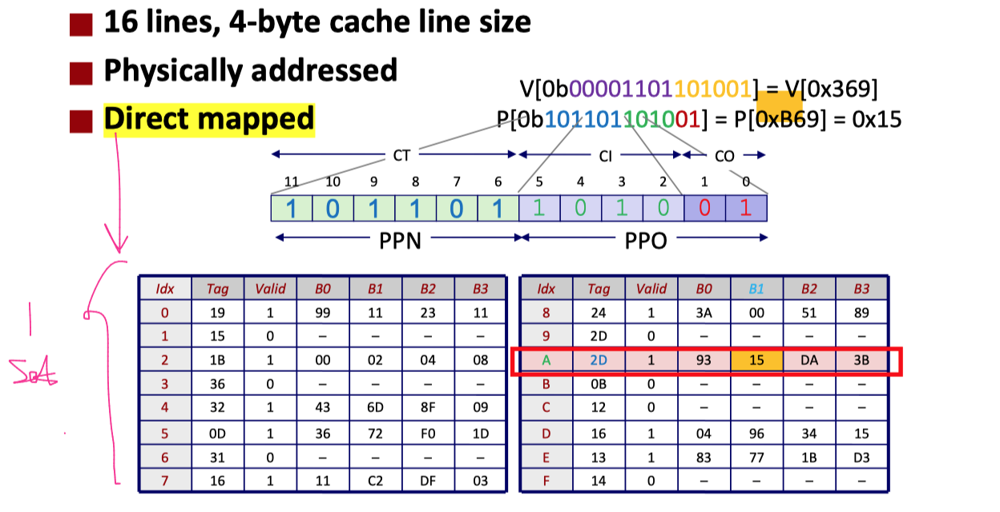

# ICS Part2

>This list only contains "in-scope" knowledges

## Code Optimization

- MI Optimization
    - Procedure Calls
    - Memory Aliasing
- MD Operation
    - Basic Programming Skills
    - Loop Unrolling
    - Pipelined Functional Units
    - Branch Predictions


### Machine-Independent Optimization

>两个优化障碍：函数调用，内存别名

- [x] Optimization Blocker: Procedure Calls

函数调用级的优化：省得循环一次调用一次


- [x] Optimization Blocker: Memory Aliasing

内存别名(一内存位置可以被两个名称访问)


1. 按理来说, b[i]在最内层循环，其应该储存在寄存器中；但实际上b[i]跑到内存当中去了，原因在于b[i]实质是指针 (定义用的是`double *b`)
2. 极端情况下， 如果b[],a[]在内存同一片地方，运行就会对a[]产生副作用，正是这一种情况导致编译器不把b[]放入寄存器
3. 解决方案是：把b[i]变成临时变量 (在栈上，不会有此问题)

解释：“正是这一种情况导致编译器不把b[]放入寄存器”

- 什么是别名问题：
    - 指针别名问题是指多个指针可能指向同一内存区域，从而导致通过一个指针修改数据会影响到通过另一个指针访问的数据。这种情况会使得编译器无法确定内存的内容是否会在某些操作之间被修改
- 编译器的困惑：
    - 如果编译器不能确定两个指针是否指向同一块内存，它就无法安全地将其中一个指针指向的值存储在寄存器中，而假定该值在寄存器中不会被其他指针修改。这会导致潜在的错误结果
- 数据一致性：
    - 为了确保程序的正确性，编译器需要保证每次通过指针访问内存时，都能获取到最新的数据。如果指针可能别名，编译器就必须保守地处理，即每次访问指针指向的内存，而不是假设值已经在寄存器中保持不变
- 防止数据竞争：
    - 如果编译器将指针指向的值缓存到寄存器中，而该值在内存中被其他操作修改了，寄存器中的值就会变得不一致。这会导致数据竞争和不可预知的行为。

>本质原因是，当需要取两个指针(\*a, \*b)值的时候，编译器的原则始终是“保持最新且正确的数据”；现在有两种可能：（1）a与b指向不同的内存空间（2）a与b指向相同的内存空间
>- (1)的话，理论上来说，指针指向的内存之间无干扰，为了提高速度，可以将“赋值方”的值提供给寄存器
>- (2)的话，后续改a的话，也会对b产生影响，编译器不知道我们要的值究竟是“b的初始值”还是“b经修改后的值”，因此它无法判定这是“特殊的人为癖好”还是“错误”
>- 因此为了保险起见，它都用内存表示，不用寄存器

### Machine-Dependent Optimization

- [x] Basic Optimizations

- Move vec_length out of loop 
- Avoid bounds check on each cycle 
- Accumulate in temporary

examples

1. 把函数调用`i < vec_length(v)`和`get_vec_element(v, i, &val);`放在循环外
2. 用临时变量代替每次循环中改变的变量

- [x] Loop Unrolling

>- 2: `i+=2`
>- 1/2: `for(...){Operation1; Operation2;}`


1. 2x1 : Reduce loop overhead 
2. 2x1a: Pipeline (流水线化处理，使得指令可以在处理器流水线中并行执行，提高指令吞吐量)
3. 2x2 : Pipeline + Multiple-EU (流水线化和多执行单元结合，最大化利用处理器的多个执行单元并行处理，提高整体计算性能)

__2x1 (循环二阶展开)__

```cpp
for (int i = 0; i < limit; i += 2)
{
    x = x OP a[i] OP a[i+1];
    //<=> x = (x OP a[i]) OP a[i+1];
    
    // CPE = D/1
}
```

1. 步长为2（`i+=2`）
2. 每次循环内只有1行，但是进行两个操作
3. 往往最后附带一个extra loop解决尾巴的问题
4. 优化的原理：每次for循环都是有开销的，打个比方，开一次门放十个作业本肯定比开十次门每次放一个效率高
5. 仅在每次循环任务不重时候有效

__2x1a (在2x1基础上调整运算顺序)__

```cpp
for (int i = 0; i < limit; i += 2)
{
    x = x OP (a[i] OP a[i+1]);
}
// CPE = D/2
```

1. 减小了数据依赖
2. 标红部分做出运算顺序的改变，这一操作是带有风险的
3. 性能提升的原因在于: `x = (x OP1 d[i]) OP2 d[i+1]`中要等OP1完成才能进行OP2，`x = x OP1 (d[i] OP2 d[i+1])` 中两个OP可并行
4. Ops in the next iteration can be started early (no dependency)

__2x2 (操作分为两半)__

```cpp
for (int i = 0; i < limit; i += 2)
{
    x1 = x1 OP a[i];
    x2 = x2 OP a[i+1];
}
// CPE = D/2
```

1. x1专门负责累加d[0/2/4....]，x2负责d[1/3/5....]
2. 原理还是数据依赖去除

>PS 如何分析CPE？
>- 最简单的办法就是，把对应for循环内的代码执行图画出来，看这个程序总共有几条主线，D/主线数 即为 CPE

- [x] Pipelined Functional Units

```cpp
long mult_eg(long a, long b, long c) { 
    long p1 = a*b; 
    long p2 = a*c; 
    long p3 = p1 * p2; 
    return p3; 
}
// We suppose each "MUL" requires 3 cycles
```

Originally, it will be `3x3=9` cycles; But now, we add "Pipeline" Mechanism


- [x] Branch Predictions

1. _Instruction Control Unit_ must work well ahead of _Execution Unit_ to generate enough operations to keep EU busy
2. If the CPU has to wait for the result of the cmp before continuing to fetch instructions, may waste tens of cycles doing nothing!
3. Guess which way branch will go:
    1. Begin executing instructions at predicted position
    2. __But__ don’t actually modify register or memory data

Principle:

>- Backwards branches are often loops, so predict taken (since we usually write "can be continued code" into `Loop{...}`)
>- Forwards branches are often ifs, so predict not taken (since we usually write "bad situation" into `if(..){..}`)


## Linking

- Symbol Resolution
- Symbol Identification
- How Linker Resolves Duplicate Symbol Definitions
- Linker’s Symbol Rules

### Symbol Table

- [x] Symbol Resolution(符号解析)：找到不同文件中定义的符号的地址


- array是全局变量，塞进符号表；
- main是定义的一个函数名，也是全局变量；
- 定义函数sum也是全局函数 
- linker不关心局部变量，所以对于val/i/s一无所知


- [x] Symbol Identification

__ELF Symbol Tables__

- Each relocatable object file has a symbol table in `.symtab` section
- A symbol table contains information about the symbols that are defined and referenced in the file
- Symbol table contains an array of entries

__Linker Symbols__

- Global symbols
    - Def: Symbols defined by module m that can be referenced by other modules.
    - E.g.: __non-static__ C functions and non-static global variables.
- External symbols （Referenced global symbols）
    - Def: Global symbols that are referenced by module m but _defined by some other module_.
- Local symbols
    - Def: Symbols that are defined and referenced exclusively by module m. 
    - E.g.: C functions and global variables __defined with the static attribute__.
    - Local linker symbols are not local program variables

Which of the following names will be in the symbol table of symbols.o?


PS: 这里foo是static int函数，由于是函数定义，所以会进符号表；但是它是Static，所以它的属性还是Local

>Conclusion(什么东西可以进符号表)
>1. 全局变量的定义
>2. 函数定义

### Symbol Rules

- [x] How Linker Resolves Duplicate Symbol Definitions

1. Strong Signal: function + Global Variables(been defined)
2. Weak Signal: Global Variables(not been defined) + Local Variables


__基于强弱符号的链接规则__

>特别注意：如果x1成功链接到x2，那么所有对x2的操作都会变成对x1的操作

1）多强无弱，强符号不允许重名，否则报错


2）一强多弱，弱的链接到(指向)强的 ( _linker不进行 符号类型查询_ )


这个例子值得推敲一下：

- `int x`与`double x`变量名相同，只是类型不同，由于linker不进行符号类型查询，故认为二者相同
- 右边文件所有对x的操作，都会转化为对左边文件x地址的操作，但二者操作方法不一样，所以冲突

3）无强多弱，随机选择一个弱符号，让所有弱符号指向它


## Processes and Multitasking

- Creating Processes
- Conceptual View of fork
- Modeling fork with Process Graphs


- [x] Creating Processes

1. 建立进程：只能通过让父进程调用函数`fork`创建子进程
2. 父子进程几乎一样：子进程获得与父进程相同的虚拟地址空间 __独立副本__，子进程获得父进程打开文件的副本，但 __二者PID不一样__
3. fork完之后先执行子进程还是父进程是 __完全随机的__，千万不要想当然假设先执行哪个

- [x] Conceptual View of fork

Trait: 调用一次，返回两次

1. 父进程中: 返回子进程的PID(标识进程的唯一ID)
2. 子进程中: 返回0
3. 所以我们可以在fork以后，_利用返回值约束下一段代码是子进程还是父进程中运行_

Process: fork函数原理 (完全复制执行状态 → 指定谁父谁子 → 恢复执行)


右边是两种可能的运行结果，该例子说明：

1. 子进程和父进程中的x相互独立
2. 子进程和父进程执行顺序随机

- [x] Modeling fork with Process Graphs

进程图：node表示一个语句的执行 + 有向Edge代表先后顺序

1. "a->b"代表a先于b执行，点的上下位置相同代表执行同步
2. 可以用变量当前值来标记边，printf顶点可以用输出进行标记
3. 每个图都以一个没有内边的顶点开始
4. 执行一次fork函数会导致一条边叉出来


## Exceptional Control Flow

- Basic Concepts
- Signal Concepts: Sending a Signal
- Receiving Signals

### ECF concepts

- [x] Basic Concepts

1. An exception is a transfer of control to the OS kernel in response to some event (i.e., change in processor state)
2. Kernel is the memory-resident part of the OS
3. Examples of events: Divide by 0, arithmetic overflow, page fault, I/O request completes, typing Ctrl-C

__Exception Tables__

1. Each type of event has a unique exception number k
2. Handler k is called each time exception k occurs


- [x] Signal Concepts: Sending a Signal

Def:

A signal is a small message that notifies a process that an event of some type has occurred in the system

Trait:

1. Sent from the kernel (sometimes at the request of another process) to a process
2. Signal type is identified by small integer ID’s (1-30)

>PS: Only information in a signal is its ID and the fact that it arrived

### What's Happening when Receiving Signals

- [x] Receiving Signals

Some possible reaction:


信号的接收：异步

- 在进程q进行的时候，发送信号 
- 在context switch的时候，检测kernel：有信号进入进程q就处理，没有信号就回来


__Pending and Blocked Signals__

A signal is pending if sent but not yet received

- There can be __at most one pending signal of each type__
- Important: __Signals are not queued (in pendingTable)__
    - If a process has a _pending_ signal of type k, then _subsequent signals of type k_ that _are sent to that process_ are discarded

```bash
pending: represents the set of pending signals 
- Kernel sets bit k in pending when a signal of type k is sent 
- Kernel clears bit k in pending when a signal of type k is received
```

A process can block the receipt of certain signals

- Blocked signals can be sent, but __will not be received until the signal is unblocked__
- Some signals cannot be blocked (SIGKILL, SIGSTOP) or can only be blocked when sent by other processes (SIGSEGV, SIGILL, etc)

```bash
blocked: represents the set of blocked signals 
- Can be set and cleared by using the sigprocmask function
```

A pending signal is received at most once

- [x] A typical example (Significant!!!)


Situation here:

1. A is sending a signal to C
2. Then B wanna send C a signal as well
3. Guess what will C do ?

>It's important to understand why we introduce "Pending for A Process" and "Blocked for A Process"

1. A wanna send a signal to C, C is working on its own items:
    1. __"Pending for C" is 1__ now, which implys A has a signal to send for C
    2. Since C is "resting" now (No Blocked for C), C will handle "Singnal from A" then
    3. But C is doing its own items now, it may not good to be interupted
    4. In another word, C will handle it as soon as it finishes current items
    5. Hence: __"Blocked for C" is set to 1__
    6. It means, C said: "I will handle A's signal as soon as I finish my work now, and the next period is just for 'A's signal', nobody can come into processing queue in that duration"
2. B wanna send a signal to C, C is working on its own items:
    1. Since C hasn't process A's item, both "Pending for C" and "Blocked for C" are 1
    2. "Signals are not queued (in pendingTable)"
    3. the message "Pending for C (from B)" will __be discarded at once__ since there can be at most one pending signal of each type.
3. When C is finished, it is coming for A's signal:
    1. Since C is finished, __"Blocked for C" is set back to 0__
    2. And it is receiving message from A now
    3. Since A's signal is received, __"Pending for C (from A)" returns to 0__ now


## Virtual Memory

### Basic Design: System Using Virtual Addressing


>Used in all modern servers, laptops, and smart phones

1. 在进程中看到的所有地址都是虚拟地址
2. 通过CPU内的MMU将虚拟地址转化为物理地址，然后访问
3. DRAM：虚拟内存系统缓存，在主存中缓存虚拟页

### Page Table

Def: A page table is an array of page table entries (PTEs) that maps virtual pages to physical pages.


### Address Translation With a Page Table


### Basic Address Translation

__Page Hit__

Def: reference to VM word that is in physical memory (DRAM cache hit, just __fetch in Memory__)


__Page Fault__

Def: reference to VM word that is not in physical memory (DRAM cache miss, hence need to __fetch in Disk__)


Traits:

1. Page miss causes page fault (an exception)
2. Page fault handler selects a victim to be evicted (here VP 4)
3. Offending instruction is restarted: page hit!

PS:
> It's a little confusing for a beginner about the process above

1. Structure: CPU -> MMU -> Cache (L1, we ignore others) -> Disk 
2. CPU give __VA__ to MMU to switching for PA, so that it can visit this place
3. CPU -> \[VA\] -> MMU, MMU is seeking for PTE, and it asks Cache now (by sending __PTEA__)
4. Namely, MMU -> \[PTEA\] -> Cache
4. As is introduced above, PT is stored either in Cache (most) or in Disk (less)
5. If __PTE__ is stored in Cache, Cache returns PTE to MMU,...
6. Else, PTE is stored in disk, will trigger "Page Fault Exception"
7. And Page fault handler is working now! It will choose a __Victim Page__ in Cache and fetch the correct __New Page__ from Disk to Cache(like the processing in Chapter6 Memory Hierarchy)
8. And the process "VA -> PA" restarts

__Integrating VM and Cache__


### Speeding up Translation with a TLB

Translation Lookaside Buffer (TLB)

>- Small set-associative hardware cache in MMU 
>- Maps virtual page numbers to physical page numbers 
>- Contains complete page table entries for small number of pages

__TLB Hit__


A TLB hit eliminates a memory access (that's exactly what we want!)

__TLB Miss__


A TLB miss incurs an additional memory access (the PTE)
>If TLB miss, we will access Memory like before, but we return PTE to "TLB->MMU" instead of MMU

In fact, _TLB misses are rare_, for Page is very big in real computing world!

### Translating with a k-level Page Table

>This part is "out-of-scale"


```python
for i in range(1, k):
    VPN i in "Level(i) page table" just stores the beginning of "Level(i+1) page table"
    # It's just an index

if i == k:
    It stores PPN # !!!

# So: PageTable(k) is longer than PageTable(1~k-1)
```

### Actual Process (Very Important)

Components of the virtual address (VA)

- TLBI: TLB index 
- TLBT: TLB tag 
- VPO: Virtual page offset 
- VPN: Virtual page number

Components of the physical address (PA)

- PPO: Physical page offset (same as VPO) 
- PPN: Physical page number

__Example 1__





__Example 2__


本质上，这个过程很简单：

1. 我现在拿到一个虚拟内存地址(VA)
2. 我把它按照VPN与VPO切割开，VPO直接copy对照到PPO
3. 现在问题是如何获取VPN（假设全部cache hit）
    1. 将VPN分割成：TLBT与TLBI
    2. TLBI作为Set索引，获取“在哪一组”信息
    3. TLBT作为组内的Line索引，获取当前“在哪一行”信息
    4. 如果找到的这一行的ValidBit=1，说明有效，即：命中
    5. 获取这一行对应的PPN
4. 将上述的PPN和PPO拼接结合，即可得到PA

